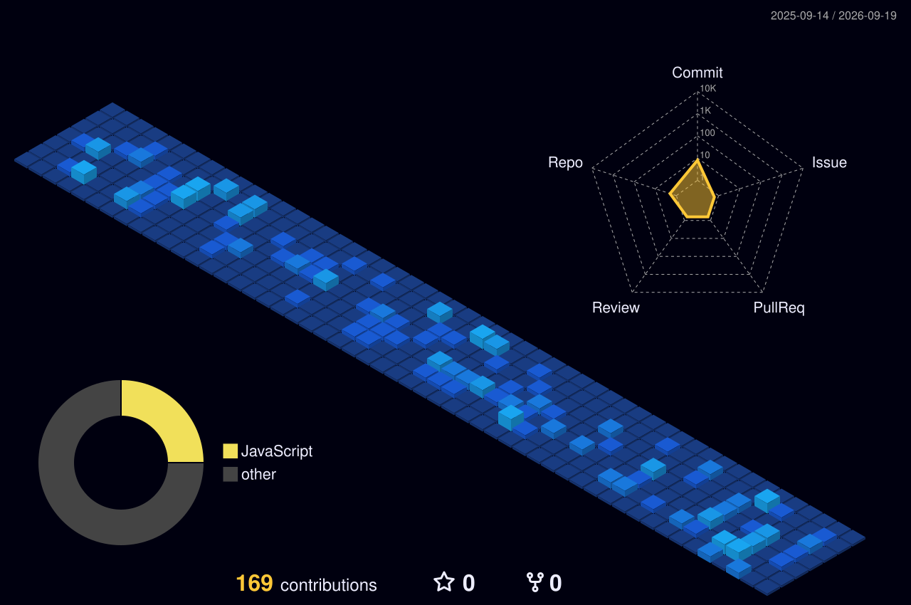

<div align="center">


# 👋 Hey, I'm **Kedar Shah**

### `Full Stack Engineer` · `Problem Solver` · `Automation Nerd` · `Systems Builder`


<br />

<a href="https://kedarshah.in">

</a>

<a href="https://github.com/Kedar355">

</a>

<a href="https://linkedin.com/in/kedar-shah355">

</a>

<a href="mailto:kedarshah355@gmail.com">

</a>

<br /><br />


</div>

---

## `whoami`

<div>


```typescript
const kedar = {
  role: "Full Stack Developer",

  philosophy: [
    "Automate the boring stuff",
    "Measure before optimizing",
    "Ship > perfect",
    "If it works, understand why",
    "If it works twice, automate it"
  ],

  currentlyExploring: [
    "React Native",
    "Advanced TypeScript",
    "Rust",
    "Go",
    "Distributed Systems"
  ]
};
```

</div>

> `sudo make-it-work && git commit -m "probably fixed it"`

⚡ Fun fact: **I debug with console.log and I'm proud of it!** 🐛 

---

## ⚡ What I Build

<table>
<tr>
<td width="50%">

### 🖥️ Modern Web Apps

Production-grade interfaces built with:

`React` · `Next.js` · `TypeScript`

Performance, scalability and clean UX.

</td>

<td width="50%">

### 🤖 Automation

Making computers handle the repetitive stuff.

`Playwright` · `Puppeteer` · `APIs` · `Workers`

</td>
</tr>

<tr>
<td width="50%">

### 🔌 Backend Systems

APIs, services and data pipelines.

`Node.js` · `Python` · `FastAPI` · `Redis`

</td>

<td width="50%">

### ☁️ Cloud & Infrastructure

Deploying, monitoring and optimizing systems.

`GCP` · `Docker` · `Linux` · `CI/CD`

</td>
</tr>
</table>

---

# 🧰 Engineering Toolbox

### Frontend

<p>

</p>

### Backend & Data

<p>

</p>

### Cloud, DevOps & Tools

<p>

</p>

### Mobile

<p>

</p>

---

# 📊 GitHub Analytics

<div align="center">




</div>

> Automatically generated with GitHub Actions.


<div align="center">

</div>

---

# 🚀 Things I Like Building

```diff
+ ⚡ Fast interfaces
+ 🧩 Reusable component systems
+ 🔌 APIs & backend services
+ 🤖 Browser automation
+ 🕷️ Crawlers & data pipelines
+ ☁️ Cloud infrastructure
+ 📊 Developer tooling
+ 🔄 Background workers
+ 🧪 Experiments that somehow become production
```

---

# 🧪 The Lab

Things currently occupying too many browser tabs:

```text
[01] React Native
[02] Advanced TypeScript patterns
[03] Rust
[04] Go
[05] Distributed systems
[06] Better automation infrastructure
[07] Developer tooling
[08] Making computers do things humans shouldn't have to
```

---

# 📈 Contribution Activity

<div align="center">

<a href="https://github.com/Kedar355">


</a>

</div>

---


```bash
$ whoami

kedar

$ cat /etc/motd

Build something useful.
Automate something annoying.
Learn something difficult.

$ git status

On branch main
Your branch is ahead of the problem.

$ echo $CURRENT_STATUS

🚀 shipping

$ uptime

still debugging...
```

---

## 📫 Let's Connect

<div align="center">

<a href="https://kedarshah.in">

</a>

<a href="https://github.com/Kedar355">

</a>

<a href="https://linkedin.com/in/kedar-shah355">

</a>

<a href="https://instagram.com/kedar._.355">

</a>

<a href="https://leetcode.com/kedarshah355">

</a>

</div>

---

<div align="center">

### `while(alive) { build(); learn(); automate(); }`

<br />


<br /><br />

<sub>Built with ❤️ · TypeScript · caffeine · questionable engineering decisions</sub>

<br /><br />


</div>
